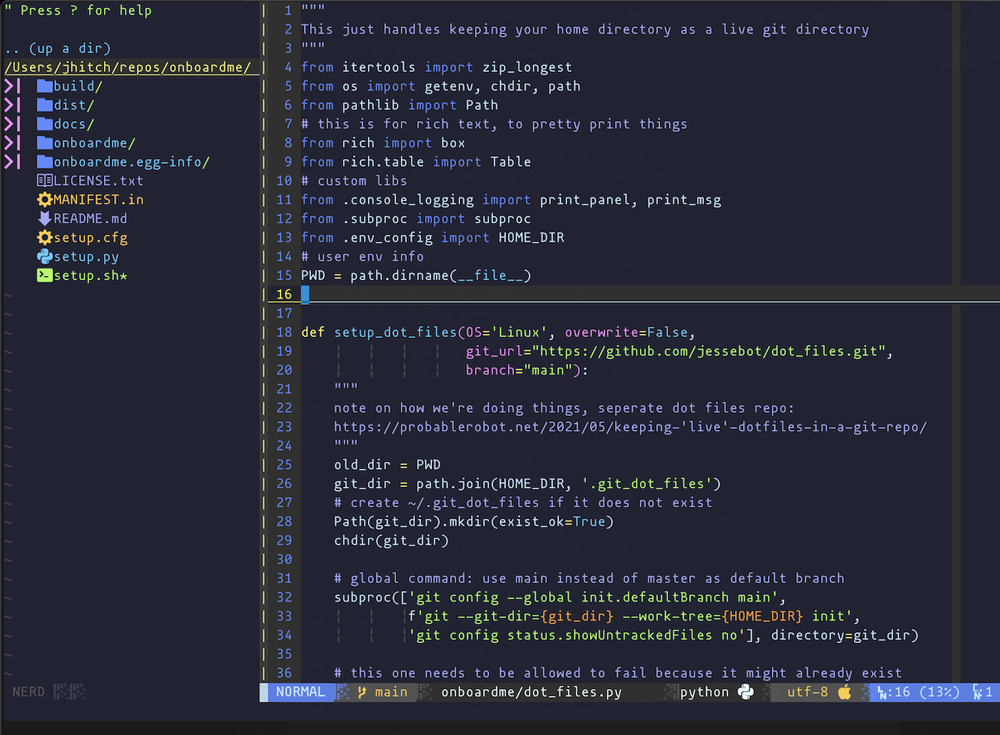

# Space Chalk Theme for Vim/Neovim
A theme trying to combine a love of neon space colors and pastel chalk board colors.



This theme also includes support for:
- airline
- gitgutter
- NERDTree

## Installation

### vim-plug

```
Plug 'jessebot/space_chalk', { 'as': 'spacechalk', 'do': ':colorscheme spacechalk' }
```

### manual

## vim

For the main scheme, you can just copy the [`colors/spacechalk.vim`](https://github.com/jessebot/space-chalk/blob/main/colors/spacechalk.vim) into your `~/.vim/colors` directory.

For the airline theme, you can copy the [`autoload/airline/themes/space_chalk.vim`](https://github.com/jessebot/space-chalk/blob/main/autoload/airline/themes/space_chalk.vim) into your `~/.vim/autoload/airline/themes` directory.

## Setup
To enable this color scheme for vim, set it in your `.vimrc`:

```vim
" If installed with vim-plug, you will want this after your vim-plug block
colorscheme spacechalk 
```

This theme assumes gui colors. Add this to your `.vimrc` to enable true colors:

```vim
if has('nvim') || has('termguicolors')
  set termguicolors
endif
```

### Airline
For airline, you'll need to add this to your `.vimrc`:

```vim
" use custome space_chalk theme :)
let g:airline_theme='space_chalk'
```

### tmux
If you are running vim inside tmux:

```tmux
set-option -g default-terminal "xterm-256color"
set-option -ga terminal-overrides ',xterm-256color:Tc'
```

## Contributing and Troubleshooting

Contributions to get the syntax highlighting working everywhere are absolutely
welcome. If you're new to vim colorschemes, here's some tips!

Use :help command to check vim help on what variables are called, e.g.
Open a python file in vim and then type the following:

```vim
:syntax list
```

That will give you all the syntax variable names and their colors as
three `x`s, like: `pythonInclude  xxx from import`

It may also be helpful to check out more about syntax/colors with:

```vim
:help syntax 
```

Finally, useful tool for learning what highlight variables are called:
[vivify](http://bytefluent.com/vivify/)
